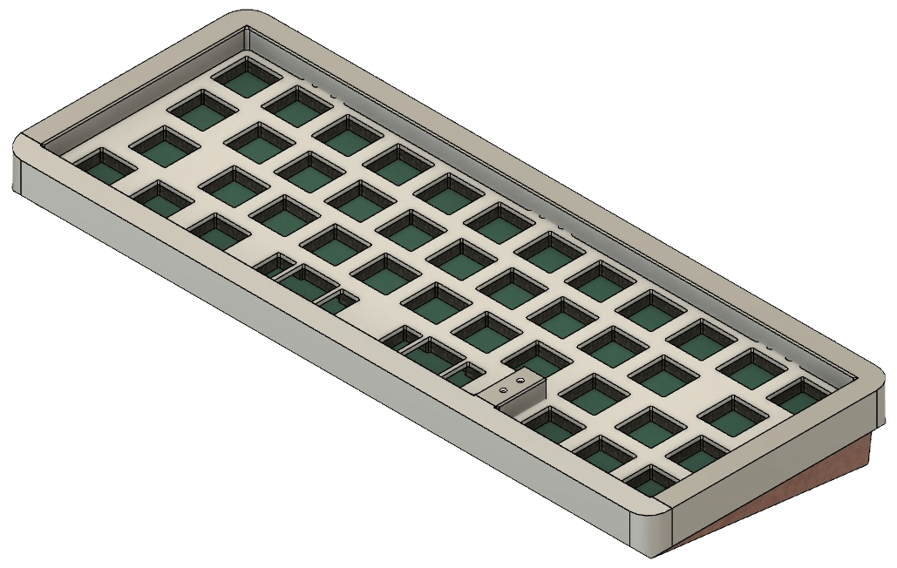

# VR42 Keyboard Case

**Fusion 360 rendering for the VR42 keyboard**

---

---

# Ideation

> Design ideas that appeal to me and __may__ be a source of insperation

- [JJWKB **Derivative** R1](https://jjwkb.com/pages/derivative-r1)
  - The anno color!
    -  - *a.k.a.* HTML color #468 - close to "Pantone / PMS 2186 UP" 
  - Bottom of KB, namely:
    - the rounding towards the back (chamfer/bevel), and gap for fingers/lifting along the edges
    - the weight's milled-in inset
  - Top of KB, namely:
    - the edging on the front lip

- [Connon Keys + `ai03` **Brutal V2**](https://cannonkeys.com/products/brutal-v2-1800-keyboard)
  - The way the top case is different color to the bottom
    - make bottom in all copper ?!
  - The way it hides the top-to-bottom seam with the 45' chamfer/bevel on the bottom edge of the top case

- Gadget System
  - On plate *(as apposed to PCB)*
  - Use [**GEON Works** Tadpole's](https://geon.works/products/tadpole)
  - ... but also allow for socks and/or jackets, like the [QwertyKeys QK's](https://www.qwertykeys.com/products/qk65-parts-1?variant=42933732212979)

## License

The case design is available as open source under the terms of the [Creative Commons Attribution-ShareAlike 4.0 International License](http://opensource.org/licenses/MIT).

&nbsp; &nbsp;
---
Made with &#9829; by **Vino Rodrigues**
