# VR42 Keyboard Case

**Fusion 360 source files for the VR42 keyboard**

---

<blockquote align="center"><b>NB:</b> This project design is complete, but has not been prototyped for validation.</blockquote>

---

<table border="0">
  <tr><td colspan="12" align="center"></td></tr>
  <tr>
    <td colspan="3" align="center">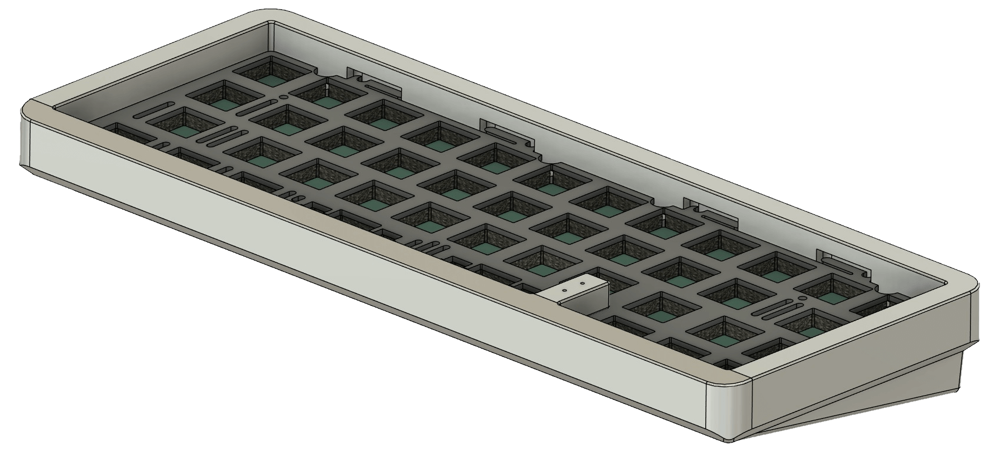</td>
    <td colspan="3" align="center">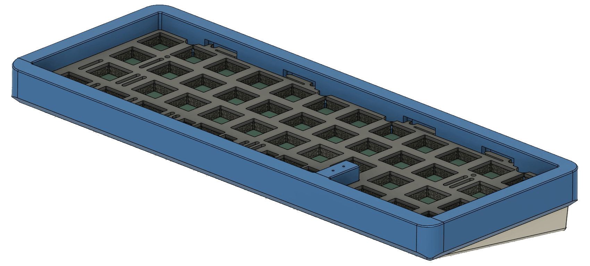</td>
    <td colspan="3" align="center">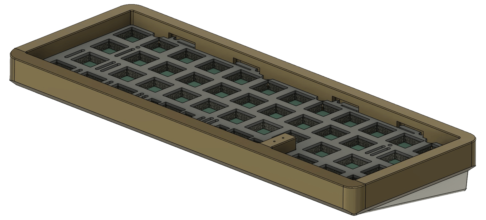</td>
    <td colspan="3" align="center">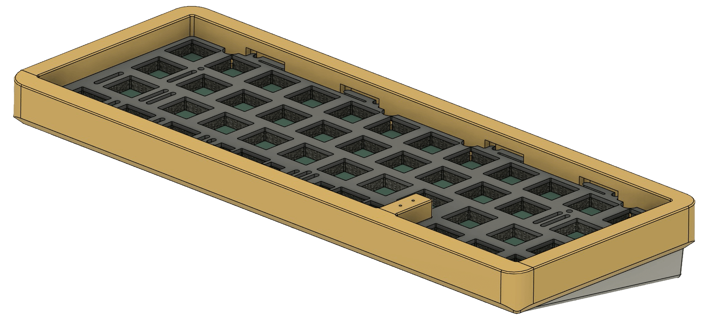</td>
  </tr>
  <tr>
    <td colspan="4" align="center">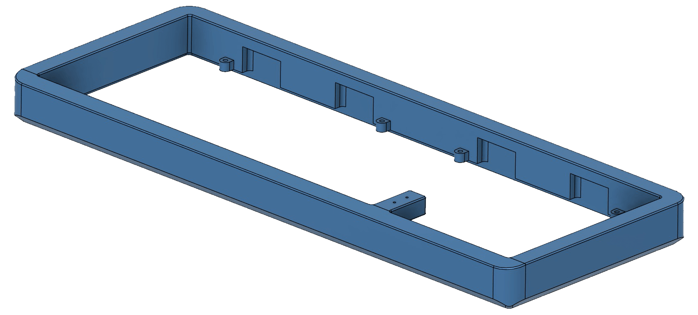</td>
    <td colspan="4" align="center">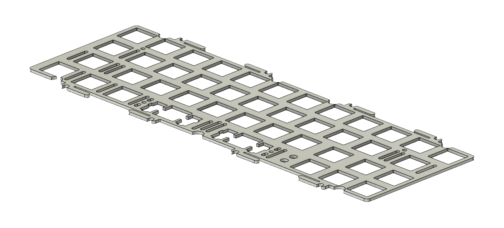</td>
    <td colspan="4" align="center">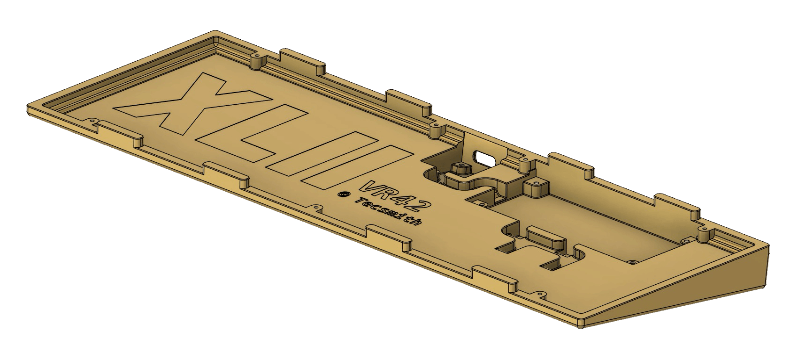</td>
  </tr>
</table>

## PCB

This case is designed in conjunction with the [VR42 Keyboard PCB](https://github.com/tecsmith/vr42-keyboard-pcb).  These two projects are mutually inclusive and built as one solution.

---

## Case

### Color options

Keyboard will be made with 3 *(plus a 4th on request)* top case options, and 2 bottom case options.

#### Top Case

|| Mac Silver | Sky Blue | Bronze Brown | Burnt Orange |
|:---:|:---:|:---:|:---:|:---:|
| Color1 |  |  |  |  | |
|| #AAA | #468 | #863 | #C63
| Panatone2 |  |  |  |  |
|| Pantone / PMS Silver 10077 C | Pantone / PMS 2186 UP | Pantone / PMS 18-0937 TPG | Pantone / PMS 16-1448 TPG | 
| Anno | 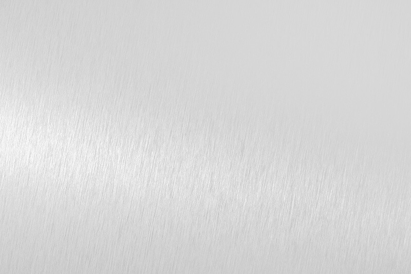 | 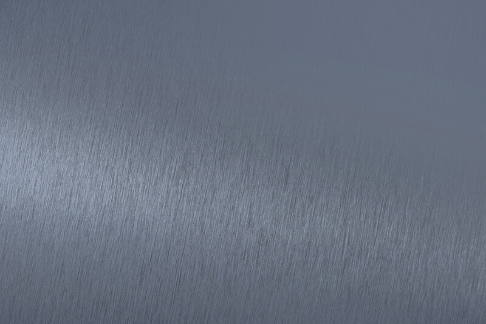 | 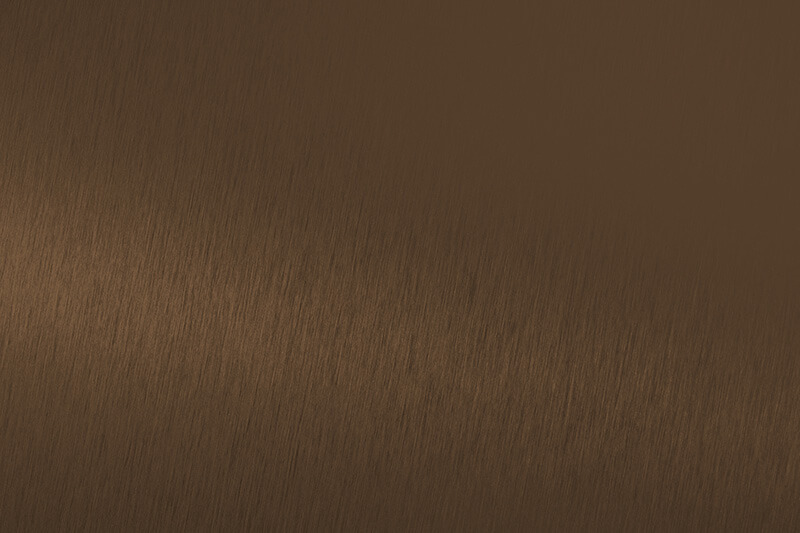 | 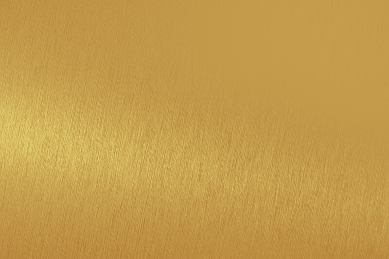 |
|| Spanish Silver | Reef Blue | Medium Bronze | Oriental | |

> 1 = This is the 3-digit hex color representation of the color, but not the actual color. 
> 2 = All attempts will be made to get as close to the Panatone color as possible, but anodization can vary, even between that same batches.

#### Bottom Case

Bottom case options will be:

- Mac Silver *(same as top case with that color option)*
- Untreated all Copper *(this **will** patina over time)*

#### Plate

### Other components

#### USB Daughterboard

- *(1x)* [**Unified Daughterboard**](https://github.com/Unified-Daughterboard/UDB-C-EZM) C-series *(Pico EzMate variant)*

  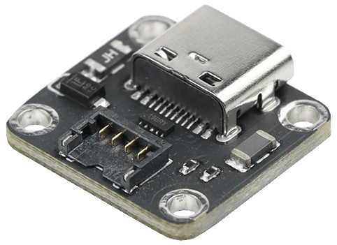

#### Gasket System

- *(8x)* [**GEON Works** Tadpoles](https://geon.works/products/tadpole)

    *&lt;or&gt;*

- *(16x)* 18x3x4 mm & 18x4x3 mm *(LxHxW)* Poron Foam Gaskets *(example [from Ali](https://aliexpress.com/item/1005004199050037.html))*

#### Feet

- *(4x)* 42×6×0.5mm [Zambumon/**SKUF Feet**](https://github.com/Zambumon/SKUF)

#### Case Screws

- *(7x)* M1.6 Screws *[TODO : Details]*

#### Daughter Board Screws

- *(8x)* M2 Screws *[TODO : Details]*

#### Plate Screws

- *(4x)* M2 [*(KBDFans)* **Plate screw and standoff set** ](https://kbdfans.com/products/kbdfans-m2-3-countersunk-flat-head-screw-kit)

  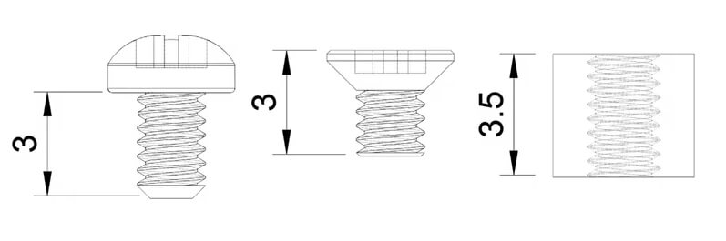

---

## Ideation / Inspiration

Design ideas came to me from the following designs:

- [JJWKB **Derivative** R1](https://jjwkb.com/pages/derivative-r1)
- [Connon Keys + `ai03` **Brutal V2**](https://cannonkeys.com/products/brutal-v2-1800-keyboard)

---

## License

The case design is available as open source under the terms of the [Creative Commons Attribution-ShareAlike 4.0 International License](http://opensource.org/licenses/MIT).

&nbsp; &nbsp;
---
Made with &#9829; by **Vino Rodrigues**
